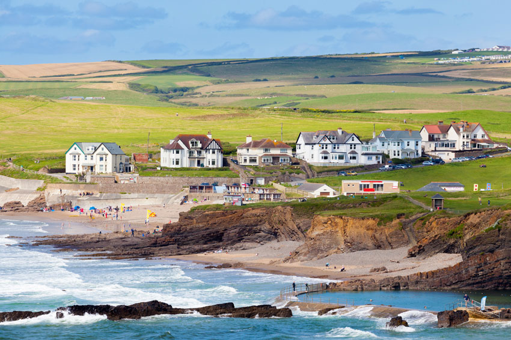
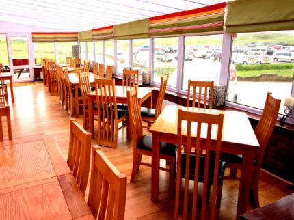

```{r,echo=FALSE,warning=FALSE,message=FALSE}
library(ggmap)
suppressMessages(library("tidyverse"))
library(tidyverse)


gc <- geocode('Bude')

gctest <- geocode("Bude North Cornwall Cricket Club, Bude")
c1 <- c(50.833664, -4.552803)

gctest2 <- geocode('Summerleaze Beach, Bude')
c2 <- c(50.831088, -4.551258)

gctest3 <- geocode('Crooklets Beach, Bude')
c3 <- c(50.836059, -4.554058)

gctest4 <- geocode('Crooklets Inn, Bude')
c4 <- c(50.836326, -4.550512)

edgcumbe <- geocode('Edgcumbe Hotel')
loc <- c(50.83139, -4.548689)

upton <- geocode('Upton cross guest house')
loc2 <- c(50.81533, -4.551806)

from <- "Crooklets Inn, Bude"
to1 <- "Crooklets Beach, Bude"
to2 <- "Bude North Cornwall Cricket Club,Bude"
to3 <- "Summerleaze Beach, Bude"

route_df1 <- route(from, to1, structure = "route")
route_df2 <- route(from, to2, structure = "route")
route_df3 <- route(from, to3, structure = "route")

maptest <- get_map(location = c(-4.543678,50.82664),zoom = 14,maptype = "roadmap")
maptest2 <- get_map(location =c(-4.543678,50.82664),zoom = 14,maptype = "watercolor")
```

##RoadMap
```{r}
ggmap(maptest)+geom_point(aes(x=lon,y=lat),
            data = gctest, color = 'red', size = 3)+geom_point(aes(x=lon,y=lat),
            data = edgcumbe, color = "blue", size = 3) + geom_point(aes(x=lon,y=lat),                                  data = upton, color = "blue", size = 3) + geom_point(aes(x=lon,y=lat),                 
            data = gctest2, color = 'red', size = 3)+geom_point(aes(x=lon,y=lat),
            data = gctest3, color = 'red', size = 3)+geom_point(aes(x=lon,y=lat), 
            data = gctest4, color = 'red', size = 3)+
  geom_text(data = gctest, aes(x=-4.552803,y=50.833664,label = 'Bude North Cornwall Cricket Club'),
            size=3)+
  geom_text(data = edgcumbe, aes(x=-4.548689,y=50.83139,label = 'Edgcumbe Hotel '),
            size=3)+
  geom_text(data = upton, aes(x=-4.551806,y=50.81533,label = 'Upton Cross Guest House'),
            size=3)+
  geom_text(data = gctest2, aes(x=-4.551258,y=50.831088,label = 'Summerleaze Beach'),
            size=3)+
  geom_text(data = gctest3, aes(x=-4.554058,y=50.836059,label = 'Crooklets Beach'),
            size=3)+
  geom_text(data = gctest4, aes(x=-4.550512,y=50.836326,label = 'Crooklets Inn'),
                              size=3)#+
  # geom_path(aes(x = lon, y = lat), size = 1.5,
  #   data = route_df1, lineend = "round")+
  #   geom_path(aes(x = lon, y = lat), size = 1.5,
  #   data = route_df2, lineend = "round",color = 'blue')+geom_path(
  #   aes(x = lon, y = lat), colour = "red", size = 1.5,
  #   data = route_df3, lineend = "round"
  # )
```

##roadmap with route
```{r}
ggmap(maptest)+
  geom_path(aes(x = lon, y = lat), size = 1.5,
    data = route_df1, lineend = "round")+
    geom_path(aes(x = lon, y = lat), size = 1.5,
    data = route_df2, lineend = "round",color = 'blue')+geom_path(
    aes(x = lon, y = lat), colour = "red", size = 1.5,
    data = route_df3, lineend = "round"
  )
```


##watercolor
```{r}
ggmap(maptest2)+geom_point(aes(x=lon,y=lat),
            data = gctest, color = 'red', size = 3)+geom_point(aes(x=lon,y=lat),
             data = gctest2, color = 'red', size = 3)+geom_point(aes(x=lon,y=lat),
            data = gctest3, color = 'red', size = 3)+geom_point(aes(x=lon,y=lat), 
            data = gctest4, color = 'red', size = 3)+
  geom_text(data = gctest, aes(x=-4.552803,y=50.833664,label = 'Bude North Cornwall Cricket Club'),
            size=3)+
  geom_text(data = gctest2, aes(x=-4.551258,y=50.831088,label = 'Summerleaze Beach'),
            size=3)+
  geom_text(data = gctest3, aes(x=-4.554058,y=50.836059,label = 'Crooklets Beach'),
            size=3)+
   geom_text(data = gctest4, aes(x=-4.550512,y=50.836326,label = 'Crooklets Inn'),
                              size=3)+
  geom_path(aes(x = lon, y = lat), size = 1.5,
    data = route_df1, lineend = "round")+
    geom_path(aes(x = lon, y = lat), size = 1.5,
    data = route_df2, lineend = "round",color = 'blue')+geom_path(
    aes(x = lon, y = lat), colour = "red", size = 1.5,
    data = route_df3, lineend = "round"
  )
```
## Bude North Cornwall Cricket Club, Bude

## Summerleaze Beach

## Crooklets Beach


## CrookletsInn


## Edgcumbe Hotel


---

Much more than just a place to stay. A beach style B&B, with the look and feel of a small hotel with the heart and soul of a family run business. Dont just stay....Belong.

This property is 1 minute walk from the beach. A boutique bed and breakfast run by a young and energetic family, the Edgcumbe offers chic seaside style with a relaxed and informal feel.

Surrounded by sandy beaches and with sweeping views over Summerleaze Beach and the Downs, the hotel is only a 2-minute easy walk from the town. The Edgcumbe has the ideal location from which to explore the many sights and experiences of Cornwall.

You could just stay in and have a Cornish Ale or Cappucino in the cafe style bar, or a glass of wine in our contemporary sun lounge. 

This is our guests' favourite part of Bude, according to independent reviews.

This property also has one of the best-rated locations in Bude! Guests are happier about it compared to other properties in the area.

Couples particularly like the location — they rated it 9.6 for a two-person trip.

This property is also rated for the best value in Bude! Guests are getting more for their money when compared to other properties in this city.  


## Upton Cross Guest House


---


Located 1 mile from the town centre of Bude, in Upton, and just 3 minutes’ walk from the seaside, Upton Cross B&B offers bed and breakfast accommodation, free Wi-Fi and free private parking.

A warm welcome awaits you at Upton Cross which occupies a lovely position with fantastic views of both the countryside and the Atlantic Ocean. We offer three double en-suite rooms and panoramic views of the coastline and of the beautiful countryside.

All rooms have tea and coffee trays with colour television. Every morning delicious home-cooked full English breakfast is prepared for you individually.

We offer a very warm welcome to families and their pets.

Only a few yards from Upton Cross you reach the secluded Upton Beach or walk along the coastal footpath to Bude with it's town and beaches.

Upton Cross is ideally situated for visitors wishing to explore this delightful yet rugged part of Cornwall and use it as a base to then discover the contrasting landscapes of nearby Bodmin Moor or a little further to the man made splendor that is the Eden Project.

---


